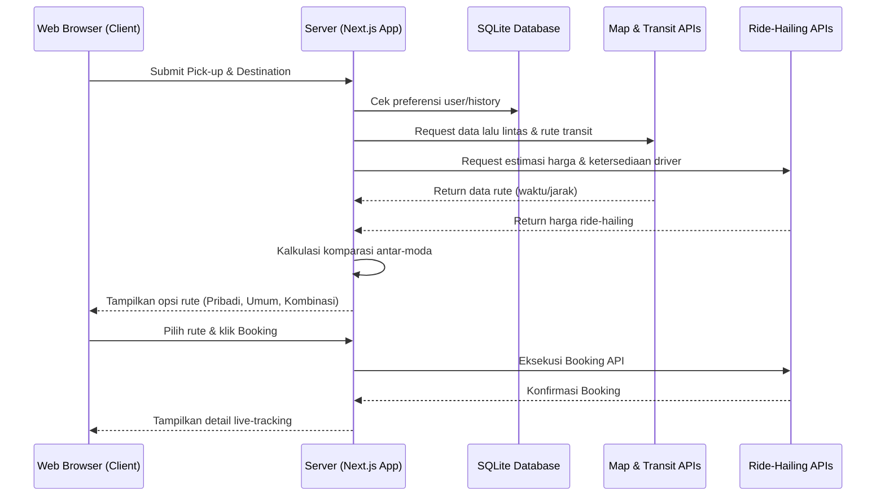
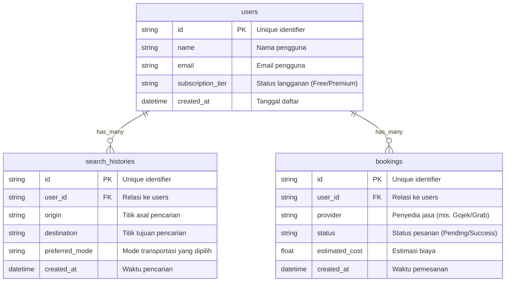

# PRD — Product Requirements Document

## 1. Overview
Komuter di kawasan Jabodetabek seringkali menghadapi kesulitan dalam menentukan rute dan moda transportasi yang paling efisien karena kemacetan, jadwal transportasi umum yang dinamis, serta biaya perjalanan yang bervariasi. 

Aplikasi ini bertujuan untuk menyelesaikan masalah tersebut dengan menyediakan platform panduan rute berbasis web. Pengguna dapat mencari, membandingkan, dan memilih rute terbaik dari titik penjemputan ke tujuan. Aplikasi ini akan membandingkan efisiensi waktu dan biaya antara menggunakan kendaraan pribadi, transportasi umum, ride-hailing (ojek/taksi online), maupun kombinasi antar-moda tersebut berdasarkan data *real-time*.

## 2. Requirements
- **Platform:** Aplikasi Berbasis Web (Web Browser) yang responsif untuk dibuka via HP maupun Laptop.
- **Target Pengguna:** Komuter harian di wilayah Jabodetabek.
- **Cakupan Wilayah:** Terbatas untuk area Jabodetabek.
- **Kemampuan Data:** Membutuhkan integrasi data *real-time* untuk kondisi lalu lintas dan jadwal/posisi transportasi umum.
- **Model Bisnis (Freemium):** Pengguna gratis dapat melihat info rute dasar. Pengguna berbayar (Premium) mendapatkan fitur ekstra seperti integrasi pemesanan (booking) langsung, bebas iklan, dan prioritas layanan pendukung.

## 3. Core Features
- **Pencarian Rute Cerdas:** Form input untuk Titik Awal (Pick up) dan Titik Tujuan.
- **Komparasi Multi-Moda:** Menampilkan perbandingan estimasi waktu, jarak, dan biaya antara:
  - Kendaraan Pribadi (Mobil)
  - Transportasi Umum (KRL, MRT, LRT, TransJakarta)
  - Ride-Hailing
  - Rute Antar-Moda (Kombinasi, misal: naik ojek ke stasiun KRL, lalu jalan kaki ke kantor).
- **Informasi Real-Time:** Menampilkan status kemacetan jalan dan estimasi kedatangan transportasi umum secara langsung.
- **Integrasi Booking (Pemesanan):** Tombol aksi untuk langsung memesan layanan *ride-hailing* tanpa perlu berpindah aplikasi (Fitur Premium/Terintegrasi).
- **Manajemen Akun Subscription:** Sistem pendaftaran pengguna, menyimpan rute favorit, dan peningkatan status akun dari Gratis menjadi Premium.

## 4. User Flow
1. **Membuka Aplikasi:** Pengguna membuka web app melalui browser HP/Laptop.
2. **Input Lokasi:** Pengguna memasukkan lokasi penjemputan (opsional: deteksi GPS otomatis) dan lokasi tujuan.
3. **Menganalisis Rute:** Sistem memproses data lalu lintas dan jadwal *real-time*.
4. **Melihat Rekomendasi:** Pengguna melihat daftar pilihan rute yang dikelompokkan (Tercepat, Termurah, Kendaraan Pribadi, Antar-moda).
5. **Memilih Rute:** Pengguna mengklik salah satu rute untuk melihat detail perjalanan langkah-demi-langkah.
6. **Aksi Eksekusi:** 
   - Jika transportasi umum/pribadi: Pengguna mengikuti panduan peta.
   - Jika membutuhkan *ride-hailing*: Pengguna mengklik tombol "Pesan Sekarang" (akan dialihkan ke flow terintegrasi).

## 5. Architecture
Aplikasi ini menggunakan arsitektur modern berbasis Client-Server, di mana Frontend menangani antarmuka pengguna, Backend menangani logika bisnis serta bertindak sebagai agregator yang menarik data dari berbagai layanan pihak ketiga (API Peta, API Cuaca/Lalu Lintas, dan API Ride-Hailing).

## 6. Database Schema
Berikut adalah struktur awal database untuk menyimpan data pengguna, riwayat pencarian, dan integrasi pesanan.

- **`users`**: Menyimpan data akun pengguna dan status langganan.
- **`search_histories`**: Menyimpan riwayat pencarian rute agar user bisa dengan cepat mencari rute yang sama.
- **`bookings`**: Mencatat riwayat pesanan angkutan (ride-hailing) yang dilakukan via aplikasi.

## 7. Tech Stack
Untuk mempercepat pengembangan awal (*Prototyping/MVP*) namun tetap memberikan performa yang tinggi, berikut adalah rekomendasi *tech stack* yang akan digunakan:

- **Frontend & Backend (Full-stack Framework):** Next.js (Memberikan kemudahan integrasi UI dan pembuatan API Routes untuk arsitektur backend di satu tempat).
- **Desain UI / Styling:** Tailwind CSS dipadukan dengan pustaka komponen tambahan seperti shadcn/ui.
- **Database Terpusat:** SQLite (Ringan, cepat, dan sangat cukup untuk kebutuhan awal sebelum *scaling* skala masif).
- **ORM (Object-Relational Mapping):** Drizzle ORM (Skema yang berbasis TypeScript dan bekerja sangat baik dengan SQLite serta Next.js).
- **Authentication:** Better Auth (Library autentikasi modern yang terintegrasi halus dengan ekosistem Next.js dan Drizzle).
- **Layanan Eksternal (Ekstra):** 
  - Google Maps API / Mapbox (Untuk rute jalan raya)
  - Trafi API / API TransJakarta KRL (Untuk data transportasi real-time Jabodetabek)